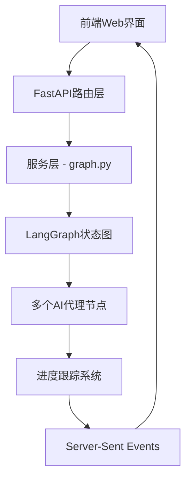
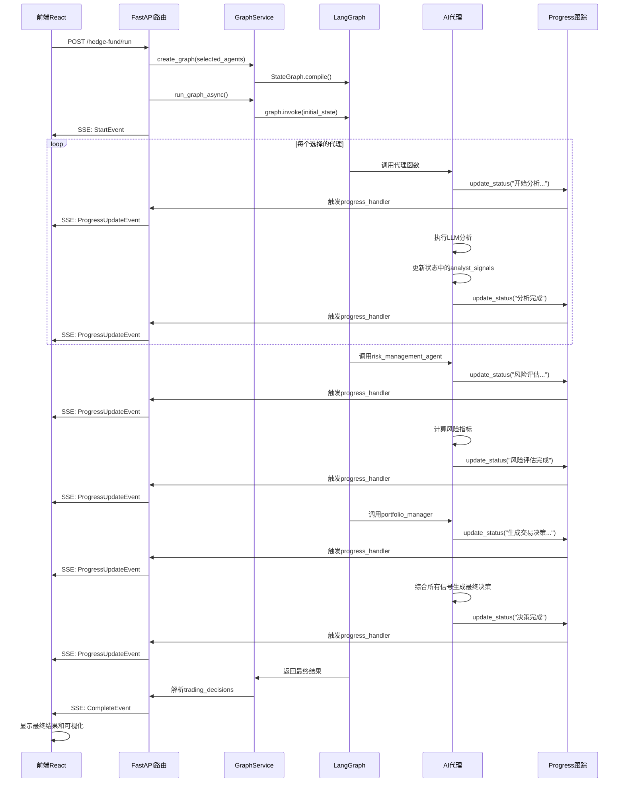

# AI对冲基金 - FastAPI与LangGraph交互架构文档

## 概述

本文档详细描述了AI对冲基金项目中FastAPI后端如何与LangGraph进行交互，实现多AI代理协同工作的完整架构。

## 项目结构关系

### `/src` vs `/app` 目录

- **`/src`** - 核心引擎（命令行版本）
  - 包含所有AI代理和算法逻辑
  - 通过命令行运行，输出文本结果
  - 功能完整，适合开发者和高级用户

- **`/app`** - Web应用版本（图形化界面）
  - **后端（FastAPI）**：调用`/src`中的核心逻辑，提供REST API
  - **前端（React + Vite）**：现代化的Web界面，可视化展示结果

### 关系图
```
ai-hedge-fund/
├── src/                    # 核心引擎（命令行版本）
│   ├── agents/            # AI代理（巴菲特、芒格等）
│   ├── graph/             # LangGraph状态管理
│   ├── main.py           # 主程序入口
│   └── backtester.py     # 回测引擎
├── app/                   # Web应用版本
│   ├── backend/          # FastAPI后端，调用src/中的功能
│   └── frontend/         # React前端界面
└── run.bat              # 运行src/版本的脚本
```

## 整体架构流程



## 核心组件详解

### 1. API路由层 (`app/backend/routes/hedge_fund.py`)

#### 主要端点
```python
@router.post("/hedge-fund/run")
async def run_hedge_fund(request: HedgeFundRequest):
```

#### 功能职责
- 接收前端请求（股票代码、选择的代理、时间范围等）
- 创建投资组合和AI代理图
- 返回Server-Sent Events流式响应

#### 关键交互代码
```python
# 1. 创建投资组合
portfolio = create_portfolio(
    request.initial_cash, 
    request.margin_requirement, 
    request.tickers
)

# 2. 构建AI代理图
graph = create_graph(request.selected_agents)
graph = graph.compile()

# 3. 异步执行图并流式返回结果
run_task = asyncio.create_task(
    run_graph_async(
        graph=graph,
        portfolio=portfolio,
        tickers=request.tickers,
        start_date=request.start_date,
        end_date=request.end_date,
        model_name=request.model_name,
        model_provider=model_provider,
    )
)
```

### 2. 服务层 - LangGraph集成 (`app/backend/services/graph.py`)

#### 核心函数：动态图构建
```python
def create_graph(selected_agents: list[str]) -> StateGraph:
    """根据用户选择动态创建AI代理工作流"""
    graph = StateGraph(AgentState)
    
    # 添加起始节点
    graph.add_node("start_node", start)
    
    # 动态添加选择的分析师代理
    for agent_name in selected_agents:
        if agent_name in ANALYST_CONFIG:
            node_name, node_func = analyst_nodes[agent_name]
            graph.add_node(node_name, node_func)
            graph.add_edge("start_node", node_name)
    
    # 添加风险管理和投资组合管理
    graph.add_node("risk_management_agent", risk_management_agent)
    graph.add_node("portfolio_manager", portfolio_management_agent)
    
    # 定义执行流程
    for agent_name in selected_agents:
        node_name = analyst_nodes[agent_name][0]
        graph.add_edge(node_name, "risk_management_agent")
    
    graph.add_edge("risk_management_agent", "portfolio_manager")
    graph.add_edge("portfolio_manager", END)
    graph.set_entry_point("start_node")
    
    return graph
```

#### 功能特点
1. **动态构建工作流**：根据用户选择的AI代理动态构建LangGraph
2. **定义执行顺序**：起始→分析师代理→风险管理→投资组合管理→结束
3. **状态管理**：使用`AgentState`在所有节点间共享数据

#### 异步执行包装
```python
async def run_graph_async(graph, portfolio, tickers, start_date, end_date, model_name, model_provider):
    """异步包装器，避免阻塞事件循环"""
    loop = asyncio.get_running_loop()
    result = await loop.run_in_executor(
        None, 
        lambda: run_graph(graph, portfolio, tickers, start_date, end_date, model_name, model_provider)
    )
    return result
```

### 3. 状态管理 (`src/graph/state.py`)

#### AgentState定义
```python
class AgentState(TypedDict):
    messages: Annotated[Sequence[BaseMessage], operator.add]  # 消息链
    data: Annotated[dict[str, any], merge_dicts]             # 共享数据
    metadata: Annotated[dict[str, any], merge_dicts]         # 元数据
```

#### 状态内容
- **`messages`**：AI代理间的对话消息链
- **`data`**：包含股票数据、投资组合、分析信号等共享信息
- **`metadata`**：模型配置、显示设置等元数据

#### 状态合并函数
```python
def merge_dicts(a: dict[str, any], b: dict[str, any]) -> dict[str, any]:
    """合并字典，用于状态更新"""
    return {**a, **b}
```

### 4. 数据模型 (`app/backend/models/`)

#### 请求模型 (`schemas.py`)
```python
class HedgeFundRequest(BaseModel):
    tickers: List[str]                    # 股票代码列表
    selected_agents: List[str]            # 选择的AI代理
    start_date: Optional[str] = None      # 开始日期
    end_date: Optional[str]               # 结束日期
    model_name: str = "gpt-4o"           # 模型名称
    model_provider: ModelProvider         # 模型提供商
    initial_cash: float = 100000.0       # 初始资金
    margin_requirement: float = 0.0      # 保证金要求
```

#### 事件模型 (`events.py`)
```python
class BaseEvent(BaseModel):
    """所有Server-Sent Event事件的基类"""
    type: str
    
    def to_sse(self) -> str:
        """转换为Server-Sent Event格式"""
        event_type = self.type.lower()
        return f"event: {event_type}\ndata: {self.model_dump_json()}\n\n"

class ProgressUpdateEvent(BaseEvent):
    """代理进度更新事件"""
    type: Literal["progress"] = "progress"
    agent: str
    ticker: Optional[str] = None
    status: str
    timestamp: Optional[str] = None
    analysis: Optional[str] = None
```

## 实时交互机制

### 1. 进度跟踪系统 (`src/utils/progress.py`)

#### 核心类设计
```python
class AgentProgress:
    """管理多个代理的进度跟踪"""
    
    def __init__(self):
        self.agent_status: Dict[str, Dict[str, str]] = {}
        self.update_handlers: List[Callable] = []  # 事件处理器列表
    
    def register_handler(self, handler: Callable):
        """注册进度更新处理器"""
        self.update_handlers.append(handler)
    
    def update_status(self, agent_name: str, ticker: str, status: str, analysis: str = None):
        """更新代理状态并通知所有处理器"""
        # 更新内部状态
        if agent_name not in self.agent_status:
            self.agent_status[agent_name] = {}
        
        self.agent_status[agent_name].update({
            "ticker": ticker,
            "status": status,
            "analysis": analysis,
            "timestamp": datetime.now(timezone.utc).isoformat()
        })
        
        # 通知所有注册的处理器
        for handler in self.update_handlers:
            handler(agent_name, ticker, status, analysis, timestamp)
```

### 2. Server-Sent Events流式响应

#### 事件生成器
```python
async def event_generator():
    """生成Server-Sent Events流"""
    progress_queue = asyncio.Queue()
    
    # 定义进度处理器
    def progress_handler(agent_name, ticker, status, analysis, timestamp):
        event = ProgressUpdateEvent(
            agent=agent_name, 
            ticker=ticker, 
            status=status, 
            timestamp=timestamp, 
            analysis=analysis
        )
        progress_queue.put_nowait(event)
    
    # 注册处理器
    progress.register_handler(progress_handler)
    
    try:
        # 启动后台任务执行LangGraph
        run_task = asyncio.create_task(run_graph_async(...))
        
        # 发送开始事件
        yield StartEvent().to_sse()
        
        # 流式发送进度更新
        while not run_task.done():
            try:
                event = await asyncio.wait_for(progress_queue.get(), timeout=1.0)
                yield event.to_sse()
            except asyncio.TimeoutError:
                continue
        
        # 获取最终结果并发送完成事件
        result = run_task.result()
        final_data = CompleteEvent(
            data={
                "decisions": parse_hedge_fund_response(result.get("messages", [])[-1].content),
                "analyst_signals": result.get("data", {}).get("analyst_signals", {}),
            }
        )
        yield final_data.to_sse()
        
    finally:
        # 清理资源
        progress.unregister_handler(progress_handler)
```

## 数据流转详解

### 1. 请求处理流程

#### 前端请求
```json
POST /hedge-fund/run
{
    "tickers": ["AAPL", "MSFT"],
    "selected_agents": ["warren_buffett", "peter_lynch"],
    "model_provider": "OPENAI",
    "initial_cash": 100000.0
}
```

#### 后端处理
```python
# 1. 创建初始状态
initial_state = {
    "messages": [HumanMessage(content="Make trading decisions based on the provided data.")],
    "data": {
        "tickers": ["AAPL", "MSFT"],
        "portfolio": {
            "cash": 100000.0,
            "positions": {"AAPL": {...}, "MSFT": {...}},
            "realized_gains": {...}
        },
        "analyst_signals": {}
    },
    "metadata": {
        "model_name": "gpt-4o",
        "model_provider": "OPENAI",
        "show_reasoning": False
    }
}

# 2. LangGraph执行
result = graph.invoke(initial_state)
```

### 2. AI代理执行流程

#### 执行顺序
```
start_node → warren_buffett_agent → peter_lynch_agent → risk_management_agent → portfolio_manager → END
```

#### 代理执行示例
```python
def warren_buffett_agent(state: AgentState):
    """巴菲特风格的价值投资分析"""
    # 发送开始分析状态
    progress.update_status("warren_buffett", "AAPL", "Analyzing fundamentals...")
    
    # 获取股票数据
    tickers = state["data"]["tickers"]
    
    # 执行分析逻辑（调用LLM）
    for ticker in tickers:
        # 分析基本面数据
        analysis = analyze_stock_fundamentals(ticker, state["data"])
        
        # 更新状态
        if "analyst_signals" not in state["data"]:
            state["data"]["analyst_signals"] = {}
        state["data"]["analyst_signals"]["warren_buffett"] = analysis
        
        # 发送完成状态
        progress.update_status("warren_buffett", ticker, "Analysis complete", analysis)
    
    return state
```

### 3. 状态在代理间的传递

```python
# 每个代理接收相同的状态结构，但可以读取和修改不同部分
state = {
    "messages": [...],  # 消息历史
    "data": {
        "tickers": ["AAPL", "MSFT"],
        "portfolio": {...},
        "analyst_signals": {
            "warren_buffett": {"AAPL": "BUY", "MSFT": "HOLD"},
            "peter_lynch": {"AAPL": "BUY", "MSFT": "BUY"}
        }
    },
    "metadata": {...}
}
```

## 关键技术特点

### 1. 异步处理架构

#### 问题解决
LangGraph是同步的，但Web应用需要异步处理，避免阻塞事件循环。

#### 解决方案
```python
async def run_graph_async(graph, portfolio, ...):
    """使用线程池执行同步的LangGraph"""
    loop = asyncio.get_running_loop()
    result = await loop.run_in_executor(None, lambda: run_graph(...))
    return result
```

### 2. 事件驱动架构

#### 设计模式
使用观察者模式，通过事件处理器实现松耦合的组件通信。

#### 实现方式
```python
# 注册事件处理器
progress.register_handler(progress_handler)

# 触发事件
progress.update_status("agent_name", "ticker", "status")

# 自动通知所有处理器
for handler in self.update_handlers:
    handler(agent_name, ticker, status, analysis, timestamp)
```

### 3. 动态图构建

#### 灵活性
根据用户选择的AI代理动态构建执行图，而不是固定的工作流。

#### 实现代码
```python
# 从配置中获取可用代理
analyst_nodes = {
    key: (f"{key}_agent", config["agent_func"]) 
    for key, config in ANALYST_CONFIG.items()
}

# 动态添加选择的代理
for agent_name in selected_agents:
    if agent_name in ANALYST_CONFIG:
        node_name, node_func = analyst_nodes[agent_name]
        graph.add_node(node_name, node_func)
        graph.add_edge("start_node", node_name)
```

### 4. 实时进度反馈

#### Server-Sent Events
提供实时的、长连接的数据推送，比轮询更高效。

#### 事件类型
- `StartEvent`: 开始执行
- `ProgressUpdateEvent`: 代理进度更新
- `ErrorEvent`: 错误信息
- `CompleteEvent`: 执行完成和最终结果

## 完整交互时序图



## 投资组合管理

### 投资组合结构 (`app/backend/services/portfolio.py`)
```python
def create_portfolio(initial_cash: float, margin_requirement: float, tickers: list[str]) -> dict:
    return {
        "cash": initial_cash,                    # 现金余额
        "margin_requirement": margin_requirement, # 保证金要求
        "margin_used": 0.0,                     # 已使用保证金
        "positions": {
            ticker: {
                "long": 0,                      # 多头持仓数量
                "short": 0,                     # 空头持仓数量
                "long_cost_basis": 0.0,         # 多头成本基础
                "short_cost_basis": 0.0,        # 空头成本基础
                "short_margin_used": 0.0,       # 空头保证金使用
            }
            for ticker in tickers
        },
        "realized_gains": {
            ticker: {
                "long": 0.0,                    # 多头已实现收益
                "short": 0.0,                   # 空头已实现收益
            }
            for ticker in tickers
        },
    }
```

## 错误处理和监控

### 异常处理策略
```python
@router.post("/hedge-fund/run")
async def run_hedge_fund(request: HedgeFundRequest):
    try:
        # 主要处理逻辑
        ...
    except HTTPException as e:
        # HTTP特定异常，直接抛出
        raise e
    except Exception as e:
        # 其他异常，包装为HTTP 500错误
        raise HTTPException(
            status_code=500, 
            detail=f"An error occurred while processing the request: {str(e)}"
        )
```

### 进度跟踪中的错误处理
```python
def update_status(self, agent_name: str, ticker: str, status: str):
    try:
        # 更新状态逻辑
        ...
        # 通知处理器
        for handler in self.update_handlers:
            handler(agent_name, ticker, status, analysis, timestamp)
    except Exception as e:
        # 记录错误但不中断执行
        console.print(f"Error updating progress: {e}", style="red")
```

## 性能优化

### 1. 异步处理
- 使用`asyncio.create_task()`并发执行长时间运行的任务
- 避免阻塞FastAPI的事件循环

### 2. 内存管理
- 及时清理事件处理器避免内存泄漏
- 使用弱引用或适当的清理机制

### 3. 连接管理
- Server-Sent Events提供持久连接，比HTTP轮询更高效
- 自动处理连接断开和重连

## 扩展性设计

### 1. 插件化代理系统
```python
# 通过配置文件动态加载代理
ANALYST_CONFIG = {
    "warren_buffett": {
        "agent_func": warren_buffett_agent,
        "description": "Value investing focused on fundamentals"
    },
    "peter_lynch": {
        "agent_func": peter_lynch_agent,
        "description": "Growth at reasonable price strategy"
    }
}
```

### 2. 模型提供商抽象
```python
class ModelProvider(Enum):
    OPENAI = "openai"
    GROQ = "groq"
    ANTHROPIC = "anthropic"
    DEEPSEEK = "deepseek"
```

### 3. 可配置的工作流
通过修改`create_graph()`函数，可以轻松调整代理的执行顺序和依赖关系。

## 安全考虑

### 1. API密钥管理
- 使用环境变量存储敏感信息
- 不在代码中硬编码API密钥

### 2. 输入验证
- 使用Pydantic模型进行请求验证
- 防止恶意输入和注入攻击

### 3. 错误信息脱敏
- 不在API响应中暴露内部错误详情
- 记录详细错误到日志，返回通用错误消息

## 部署建议

### 1. 容器化部署
- 使用Docker确保环境一致性
- 支持Docker Compose进行多服务编排

### 2. 负载均衡
- 可以部署多个FastAPI实例进行负载分担
- 注意Session状态的管理（当前是无状态设计）

### 3. 监控和日志
- 集成APM工具监控性能
- 结构化日志记录便于问题排查

## 总结

这个FastAPI与LangGraph的集成架构具有以下核心优势：

1. **解耦设计**：API层、服务层、核心逻辑清晰分离
2. **实时反馈**：通过Server-Sent Events提供流畅的用户体验
3. **动态配置**：可根据用户需求灵活调整AI代理组合
4. **异步处理**：避免阻塞，支持高并发访问
5. **状态管理**：通过LangGraph统一管理复杂的多代理状态
6. **可扩展性**：插件化设计便于添加新的AI代理和功能
7. **容错性**：完善的错误处理和进度跟踪机制

这种架构使得复杂的多AI代理系统能够通过简洁的Web界面进行操作，同时保持了系统的稳定性和可维护性。 