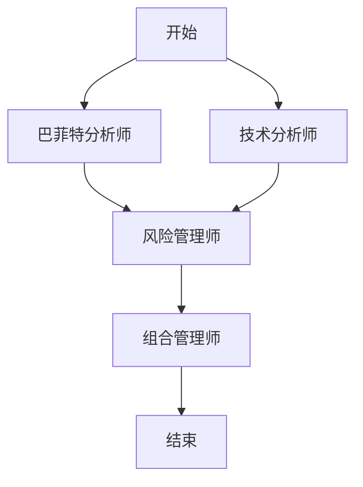

# AI投资分析系统 - Mini Demo

基于 FastAPI + LangGraph 的多AI代理投资决策系统简化版演示项目。

## 🏗️ 架构概述

本Demo完整实现了原项目的核心架构模式：

- **FastAPI** - Web API框架，提供RESTful接口
- **LangGraph** - AI代理状态管理和工作流编排
- **多AI代理协同** - 巴菲特分析师 + 技术分析师 + 风险管理师 + 组合管理师
- **Server-Sent Events** - 实时进度推送
- **动态图构建** - 根据用户选择动态创建工作流
- **事件驱动架构** - 松耦合的组件通信

## 📁 项目结构

```
mini-demo/
├── main.py              # FastAPI主应用
├── graph_service.py     # LangGraph图服务
├── agents.py            # AI代理模块
├── state.py             # 状态管理
├── progress.py          # 进度跟踪系统
├── models.py            # 数据模型和事件类
├── frontend.html        # 简单Web前端
├── test_cli.py          # 命令行测试脚本
├── requirements.txt     # 项目依赖
└── README.md           # 项目说明
```

## 🚀 快速开始

### 1. 安装依赖

```bash
pip install -r requirements.txt
```

### 2. 启动后端服务

```bash
python main.py
```

服务将在 `http://localhost:8000` 启动

### 3. 使用Web界面

在浏览器中打开 `frontend.html` 文件，即可使用图形化界面。

### 4. 或者使用命令行测试

```bash
python test_cli.py
```

## 🤖 AI代理说明

### 巴菲特分析师 (`buffett_analyst`)
- **职责**: 价值投资导向的基本面分析
- **输出**: 买入/卖出/持有建议和置信度
- **特点**: 注重内在价值评估

### 技术分析师 (`tech_analyst`)
- **职责**: 基于技术指标的趋势分析
- **输出**: 趋势方向和技术指标
- **特点**: 关注价格走势和技术信号

### 风险管理师 (`risk_manager`)
- **职责**: 评估投资组合风险
- **输出**: 风险等级、VaR、最大仓位建议
- **特点**: 自动执行，不可选择

### 组合管理师 (`portfolio_manager`)
- **职责**: 综合所有分析生成最终投资决策
- **输出**: 具体的买入/卖出/持有决策和仓位大小
- **特点**: 工作流的最后环节

## 📊 工作流程



## 🔧 API接口

### GET `/`
获取系统基本信息

### GET `/agents`
获取可用AI代理列表

### POST `/analyze`
执行投资分析（Server-Sent Events流式响应）

**请求体:**
```json
{
    "symbols": ["AAPL", "MSFT"],
    "selected_agents": ["buffett_analyst", "tech_analyst"],
    "initial_cash": 100000.0
}
```

### GET `/health`
健康检查

## 🎯 核心特性

### 1. 动态工作流构建
根据用户选择的AI代理动态创建LangGraph工作流，灵活可配置。

### 2. 实时进度反馈
通过Server-Sent Events提供实时的分析进度更新，用户可以看到每个代理的工作状态。

### 3. Mock数据模拟
使用随机生成的模拟数据，展示完整的分析流程而无需真实的股票数据API。

### 4. 异步处理
FastAPI异步架构，支持高并发请求处理。

### 5. 事件驱动架构
使用观察者模式实现组件间的松耦合通信。

## 🛠️ 技术栈

- **后端**: FastAPI, Python 3.8+
- **AI框架**: LangGraph, LangChain
- **前端**: 原生HTML/CSS/JavaScript
- **通信**: Server-Sent Events (SSE)
- **数据验证**: Pydantic
- **并发**: asyncio

## 📈 扩展示例

### 添加新的AI代理

1. 在 `agents.py` 中定义新的代理函数：

```python
def new_analyst_agent(state: AgentState):
    """新分析师代理"""
    # 实现分析逻辑
    return state
```

2. 在 `AGENT_CONFIG` 中注册：

```python
AGENT_CONFIG["new_analyst"] = {
    "name": "新分析师",
    "agent_func": new_analyst_agent,
    "description": "描述信息"
}
```

3. 在 `graph_service.py` 中添加映射：

```python
agent_mapping = {
    "new_analyst": ("new_agent", new_analyst_agent),
    # ... 其他代理
}
```

### 自定义事件类型

在 `models.py` 中添加新的事件类：

```python
class CustomEvent(BaseEvent):
    type: Literal["custom"] = "custom"
    custom_data: dict
```

## 🎨 前端界面预览

- **现代化设计**: 渐变色彩、卡片布局、响应式设计
- **实时更新**: 动态显示分析进度和状态
- **交互友好**: 代理选择、参数配置、结果展示

## 🔍 调试和监控

### 查看详细日志
启动服务时会显示详细的执行日志

### 进度跟踪
每个代理的执行状态都会实时反馈给前端

### 错误处理
完善的异常捕获和错误信息提示

## 📝 注意事项

1. 本Demo使用mock数据，不连接真实的股票数据源
2. AI分析结果为随机生成，仅用于演示架构模式
3. 适合学习和理解多AI代理系统的设计模式
4. 生产环境需要集成真实的数据源和AI模型

## 🤝 贡献

欢迎提交Issue和Pull Request来改进这个Demo项目！

## �� 许可证

MIT License 